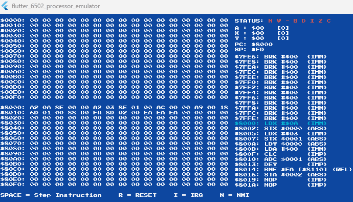

# 6502 Emulator in Dart

This is a 6502 emulator written in Dart. It is a port of the [6502 emulator in C++] by [Javidx9](https://github.com/OneLoneCoder) to Dart.

Here is a [demo](https://www.youtube.com/watch?v=8XmxKPJDGU0) of the original C++ version.

